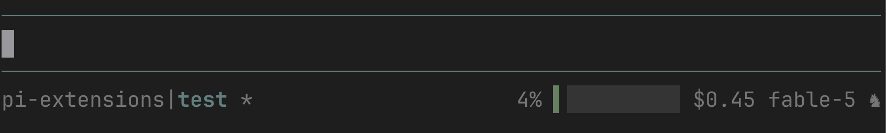

# pi-extensions

Personal [pi](https://pi.dev) extensions, skills, prompts, and themes.

## Install

```bash
pi install https://github.com/majido/pi-extensions
```

## Extensions

### branch-worktree

Creates a git worktree from a base branch and opens it in a sibling [cmux](https://github.com/nicholasgasior/cmux) workspace.

```
/branch <name> [--base ref] [--worktree-dir dir] [--command cmd]
/branch-done [--no-retro] [--keep-branch]
/worktree-status
```

Auto-detects `origin/main` or `origin/master` as the base. `/branch-done` checks the branch PR status with `gh pr view`; if no PR is found or the PR is not merged, it asks before cleanup. After confirmation it runs a session retro (written to `~/.agents/retros/`), then removes the worktree, deletes the branch (unless `--keep-branch`), and closes the cmux workspace once the retro finishes.

<details>
<summary>Env vars</summary>

| Env var | Default | Description |
|---------|---------|-------------|
| `PI_BRANCH_BASE` | auto-detect | Base branch for new worktrees |
| `PI_BRANCH_WORKTREE_DIR` | `.worktree` | Directory for worktrees relative to repo root |
| `PI_BRANCH_AGENT_COMMAND` | `exec pi` | Command to run in the new cmux workspace |

</details>

### custom-footer

Replaces the default footer with a compact, single-line layout: repo/branch with git indicators on the left, context usage, cost, and model on the right.



Responsive: on narrow terminals, segments hide progressively — bar, repo, cost, branch, model, then context % — and the right block stays right-aligned.

<details>
<summary>Display details</summary>

- **Git indicators**: `*` dirty, `⇣`/`⇡` behind/ahead, `⑂` worktree separator (`|` for regular checkouts). Branch resolved per-worktree.
- **Context bar**: eighth-block resolution (`▏▎▍▌▋▊▉█`) over a `░` track, with a color gradient from success → warning → error as context fills.
- **Thinking level**: chess glyphs, ascending by rank — ♙ minimal · ♟ low · ♞ medium · ♛ high · ♚ max.
- **MCP status** is inlined (`· MCP 2/6`) when servers are connected; other extension statuses render on a second line.
- Tests: `npm test` (layout logic is exported as pure functions in `extensions/custom-footer.test.ts`).

</details>

### compact-bash

Overrides the built-in `bash` tool's result renderer to save vertical space: compact durations (`0.6s`), `no output` inlined with the duration, one less trailing line. Execution, streaming, and truncation are inherited from the built-in tool.

### answer

`/answer [guidance]` extracts questions from the last assistant message and presents an interactive TUI to answer them one by one. From [mitsuhiko/agent-stuff](https://github.com/mitsuhiko/agent-stuff).

### pr-sitter-status

Status widget below the editor showing the active PR sitter (see the `pr-sitter` prompts):

```
PR Sitter: #39 iris • watching • next check in 3m (last one 43s ago)
```

Display-only; reads state from `~/.cache/pr-sitter/`, refreshes every 30s.
Scoped to the owning session: a sitter is shown only in the session/worktree
that armed it (matched by `sessionId`, adopted from `cwd` for legacy files), so
status never bleeds into unrelated sessions sharing the global cache dir.

### vertex-claude

Registers Google Cloud Vertex AI as a provider for Claude models (Opus, Sonnet, Haiku, Fable) using the Anthropic Vertex SDK. Requires `GOOGLE_CLOUD_PROJECT` and application default credentials (`gcloud auth application-default login`). Run `/model` in pi to see the registered `vertex-claude/*` models.

<details>
<summary>Configuration</summary>

| Env var | Default | Description |
|---------|---------|-------------|
| `GOOGLE_CLOUD_PROJECT` | *(required)* | GCP project ID |
| `GOOGLE_CLOUD_VERTEX_LOCATION` | `us-east5` | GCP region for Vertex AI |

Models that are only served on the `global` Vertex endpoint are routed there automatically.

</details>

## Prompts

### Workflow commands (from agent-skills)

`/spec` · `/plan` · `/build [auto]` · `/test` · `/review` · `/code-simplify` — spec-driven development, planning, incremental TDD implementation, testing, five-axis code review, and behavior-preserving simplification. Ported from [addyosmani/agent-skills](https://github.com/addyosmani/agent-skills) (MIT), together with the associated skills and shared checklists in `references/`. See `docs/RETIRED.md` for the personal skills they replace.

### pr-sitter

`/pr-sitter [stop|status|focus]` cleans up the working tree, commits, opens a draft PR, then babysits CI and reviews with exponentially backed-off monitor cycles (`pr-sitter-monitor` runs each cycle via scheduled prompts). Straightforward fixes are pushed as new commits; anything ambiguous is escalated.

## Skills

- **commit** — Conventional Commits guidance; read before making git commits.
- **session-retro** — structured, evidence-cited session retrospective; used by `/branch-done` and reusable standalone. Retros are written to `~/.agents/retros/<YYYY-MM-DD>-<slug>.md`.
- **skillify** — turn a repeatable workflow from the current session into a reusable skill draft.
- **agent-skills adoption** — 13 skills from [addyosmani/agent-skills](https://github.com/addyosmani/agent-skills): spec-driven-development, context-engineering, planning-and-task-breakdown, incremental-implementation, test-driven-development, code-review-and-quality, code-simplification, debugging-and-error-recovery, doubt-driven-development, browser-testing-with-devtools, security-and-hardening, performance-optimization, documentation-and-adrs. Shared checklists live in `references/` and are linked from skills via `../../references/`.

## Structure

```
extensions/    → pi extensions (.ts)
skills/        → agent skills (SKILL.md folders)
prompts/       → prompt templates (.md)
references/    → shared checklists linked from skills
themes/        → themes (.json)
docs/          → screenshots and docs
```
